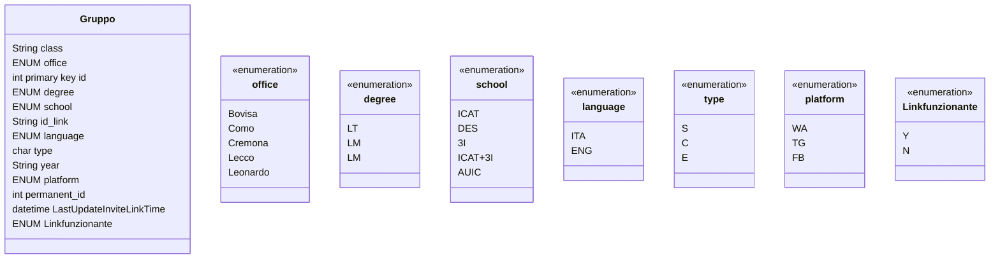

```mermaid
classDiagram

class Gruppo {
  String class
  ENUM office
  int primary key id
  ENUM degree
  ENUM school
  String id_link
  ENUM language
  char type
  String year
  ENUM platform
  int permanent_id 
  datetime LastUpdateInviteLinkTime
  ENUM Linkfunzionante
}

class office{
  <<enumeration>>
  Bovisa
  Como
  Cremona
  Lecco
  Leonardo
}

class degree{
  <<enumeration>>
  LT
  LM
  LM
}

class school{
  <<enumeration>>
  ICAT
  DES
  3I
  ICAT+3I
  AUIC
}

class language{
  <<enumeration>>
  ITA
  ENG
}

class type{
  <<enumeration>>
  S
  C
  E
}

class platform{
  <<enumeration>>
  WA
  TG
  FB
}

class Linkfunzionante{
  <<enumeration>>
  Y
  N
}
```
