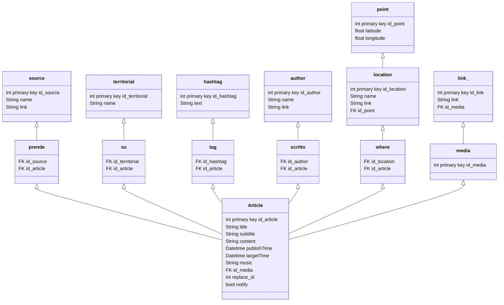

```mermaid
classDiagram

class Article {
  int primary key id_article
  String title
  String subtitle
  String content
  Datetime publishTime
  Datetime targetTime
  String music
  FK id_media
  int replace_id
  bool notify
}

class hashtag{
  int primary key id_hashtag
  String text
}

class territorial{
  int primary key id_territorial
  String name
}

class media{
  int primary key id_media
}


class link_{
  int primary key id_link
  String link
  FK id_media
}

class point{
  int primary key id_point
  float latitude
  float longitude
}

class location{
  int primary key id_location
  String name
  String link
  FK id_point  
}

class author{
  int primary key id_author
  String name
  String link
}

class source{
  int primary key id_source
  String name
  String link
}

class scritto{
  FK id_author
  FK id_article
}

class su{
  FK id_territorial
  FK id_article
}

class prende{
  FK id_source
  FK id_article
}

class where{
  FK id_location
  FK id_article
}

class tag{
  FK id_hashtag
  FK id_article
}

prende <|--Article
source <|--prende

su <|--Article
territorial<|--su

tag <|--Article
hashtag<|--tag

scritto <|--Article
author<|--scritto

where <|--Article
location<|--where
point <|--location

media <|--Article
link_<|--media


```
