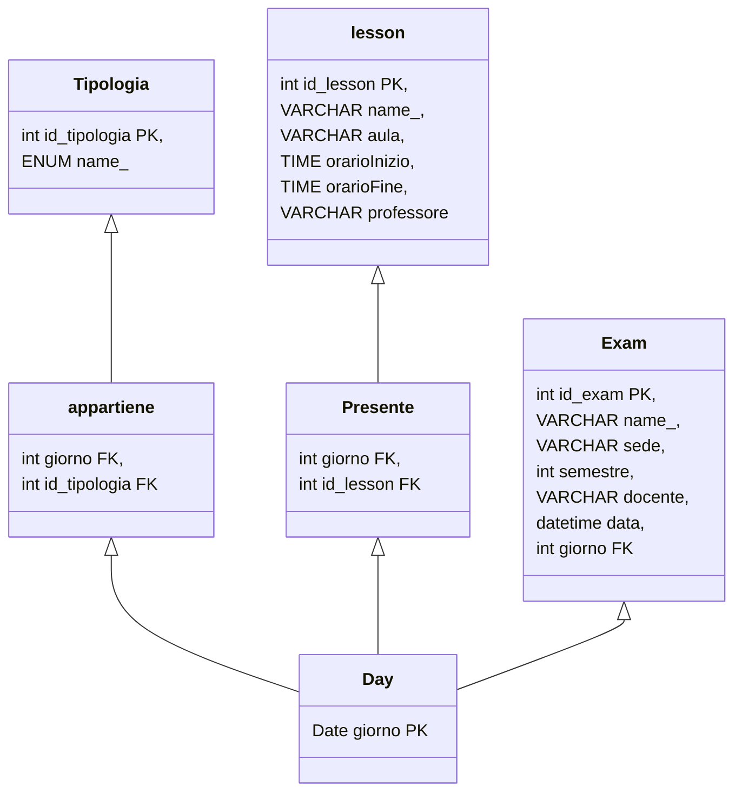

```mermaid
classDiagram

class Day {
  Date  giorno PK
}

class Tipologia{
int id_tipologia PK,	
ENUM name_ 
}

class appartiene{
int giorno FK,
int id_tipologia FK
}

class lesson{
int  id_lesson PK,	
VARCHAR name_,
VARCHAR aula,
TIME orarioInizio,
TIME orarioFine,
VARCHAR professore
}

class Presente{
int giorno FK,
int id_lesson FK
}

class Exam{
int id_exam PK,	
VARCHAR name_,
VARCHAR sede,
int semestre,
VARCHAR docente,
datetime data,
int giorno FK
}

appartiene<|--Day
Tipologia<|--appartiene

Presente<|--Day
lesson<|--Presente

Exam<|--Day


```
