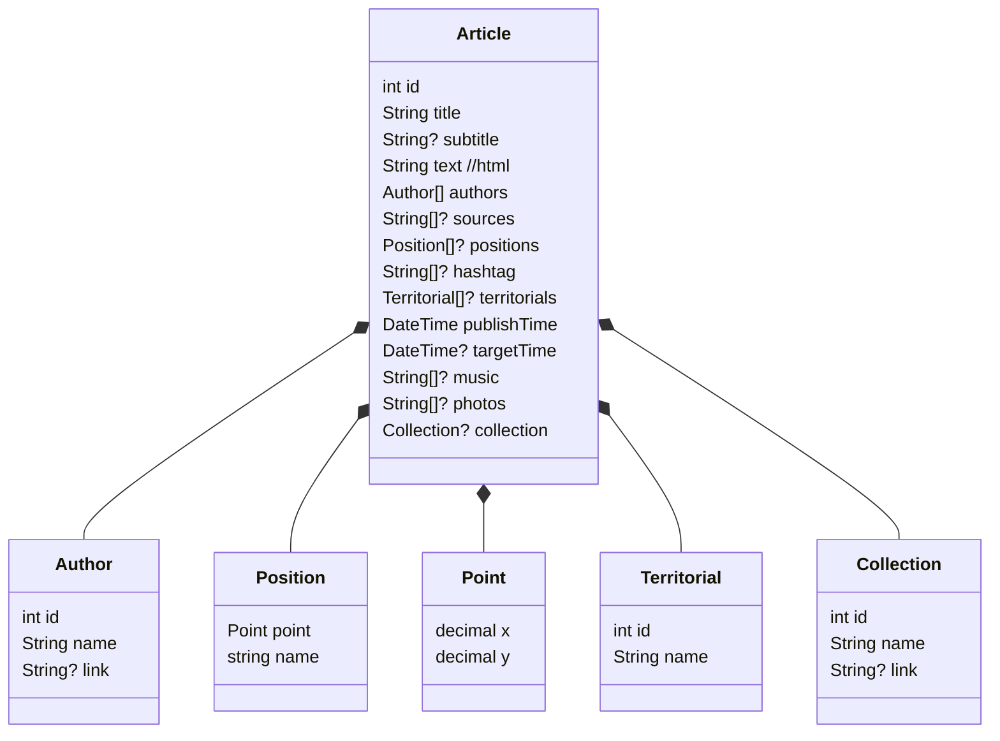

```mermaid
classDiagram

Article *-- Author
Article *-- Position
Article *-- Point
Article *-- Territorial
Article *-- Collection

class Article {
  int id
  String title
  String? subtitle
  String text //html
  Author[] authors
  String[]? sources
  Position[]? positions
  String[]? hashtag
  Territorial[]? territorials
  DateTime publishTime
  DateTime? targetTime
  String[]? music
  String[]? photos
  Collection? collection
}

class Author {
  int id
  String name
  String? link
}

class Position {
   Point point
   string name
}

class Point {
   decimal x
   decimal y
}

class Territorial {
   int id
   String name
}

class Collection {
	int id
	String name
	String? link
}
```
