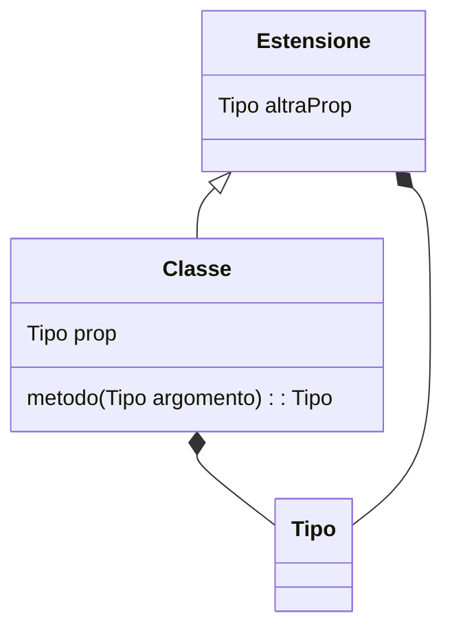

---
---
# diagrams

Per la documentazione tecnica si può usare Markdown in combinazione con mermaid.js

- [Come inserire diagrammi Mermaid nel GitHub-flavored Markdown](https://docs.github.com/en/get-started/writing-on-github/working-with-advanced-formatting/creating-diagrams#creating-mermaid-diagrams)
- [Mermaid Class Diagrams](https://mermaid-js.github.io/mermaid/#/classDiagram)

Esempio:

Risultato:

